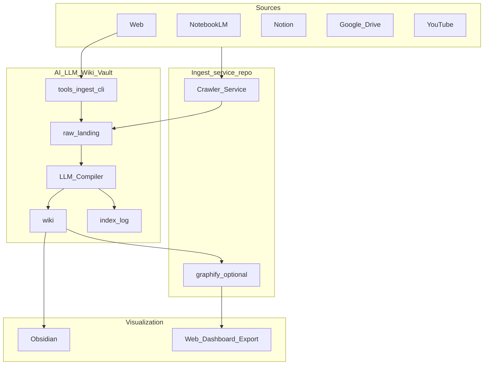

# Design — 知識宇宙 Pipeline

> **OpenSpec SDD · v1.0-baseline**（凍結見 [`SPEC_VERSION.md`](SPEC_VERSION.md））  
> 架構、資料合約、ingest-service 與 ingest-cli 雙路徑、安全、**現狀 vs 目標**、LLM 路由與 Gate 索引。

## 1. 系統情境



**路徑說明（問卷）：**

- **ingest-service**（獨立 Repo，路徑：`<external-repo-path>`）：多連接器、可排程；可選使用 Repo 內 **`graphify`**（`detect → … → export` 管線見該專案 `ARCHITECTURE.md`）產出 `graph.json`／HTML 等，供 Web 儀表板使用。
- **ingest-cli**：Vault [`tools/ingest_cli.py`](../../tools/ingest_cli.py)，本機 CLI，預設 **`raw/web/`**。

兩者皆 **只寫 raw**，不直接改 `wiki/`；語意編譯仍依 [`CLAUDE.md`](../../CLAUDE.md)（「整理」）。

### 1.1 三階段責任（摘要）

| 階段 | 責任 |
|------|------|
| Mnemosyne | 輸入、去重、索引、可追溯 |
| Muse | 跨主題關聯、洞見提案、引用證據 |
| Metis | 策略拆解、風險評估、行動追蹤與提醒 |

## 2. 真實來源與匯出層

| 層級 | 權威 | 說明 |
|------|------|------|
| 內容與連結 | **Vault**（`wiki/`、`index.md`） | 編輯、雙向連結、分類目錄以 Obsidian 為準。 |
| 原始存檔 | **`raw/`** | 只進不改（CLAUDE 規則）；擷取層寫入新檔。 |
| Web 儀表板 | **匯出物** | 由 `wiki/` 或圖譜建置流程 **定期產生**；預設 **單向**；若日後「回寫」需另開 US。 |

## 3. Raw 落地合約

### 3.1 目錄慣例（與現有 Vault 對齊）

| `source_type` | 建議路徑 | 備註 |
|---------------|----------|------|
| web | `raw/web/` | 與 `ingest-cli` 預設一致 |
| notebooklm | `raw/notebooklm/` | 已存在 |
| notion | `raw/Notion/…` | 已存在巢狀目錄 |
| gdrive | `raw/gdrive/` | 實作階段建立 |
| youtube | `raw/youtube/` | 實作階段建立 |
| journal | `raw/journal/` | `/journal-write` |
| wellness | `raw/wellness/` | `/wellness-log` |

### 3.2 Metadata（建議 YAML 檔頭）

```yaml
---
source_type: web | notebooklm | notion | gdrive | youtube | journal | wellness
source_id: "<unique-per-origin>"
canonical_url: "<https://...>"
retrieved_at: "2026-04-10T12:00:00+08:00"
ingest_path: "ingest-service | ingest-cli | manual-vault"
license_notes: "personal-archive"
---
```

- **ingest_path** 用於區分 **ingest-service**、**ingest-cli** 與手動落地，便於除錯與去重。

### 3.3 去重策略（預設）

- 以 **`source_type` + `source_id`**（或 `canonical_url` 正規化）為鍵。
- 若同鍵再進料：**新檔名加日期或短 hash 後綴**，並在 `log.md` 整理記錄中註明「同來源更新」；**不**刪除舊 raw。

## 4. ingest-service 與 Wiki 的介面（設計預留）

| 機制 | 用途 | 備註 |
|------|------|------|
| **HTTP API**（可選） | Wiki 或自動化觸發「抓取任務」 | 需認證、請求體含 `target`、回傳 job id 或落地路徑 |
| **共用檔案系統／掛載** | ingest-service 直接寫入 Vault 的 `raw/` | 同機開發最簡；注意權限 |
| **Artifact bundle** | 服務寫入暫存目錄，再由腳本移入 `raw/` | 適合 CI |

**ingest-service 路徑：** `<external-repo-path>`（本機）；CI／其他機器以環境變數覆寫。

## 5. ingest-cli（現狀對齊）

- **行為摘要**：`trafilatura` → `readability-lxml` → 啟發式；`markdownify` 轉 Markdown；預設輸出目錄見腳本內 `DEFAULT_OUTPUT`（指向 `raw/web`）。
- **已對齊項目**（2026-04-10）：
  - 檔頭 YAML：`source_type`、`source_id`（`sha256(url)`）、`canonical_url`、`retrieved_at`、`ingest_path`、`license_notes`
  - 主標格式採 C：`# 文章主標` + 次行 `> 來源站點：{site_name}（{domain}）`
  - 內容品質：多候選抽取擇長、段落斷行正規化、尾段噪音裁切（**僅在正文最後 10 行內**掃描）
  - 相容性：保留 `--legacy` 供舊格式輸出（無 YAML）

**最小匯入閉環：** [`commands/wiki-import.md`](commands/wiki-import.md) · 包裝腳本 [`tools/wiki-import.sh`](../../tools/wiki-import.sh)。

## 6. 編譯與記錄

- **觸發**：使用者於此 Vault 對 AI 下達「整理」、或排程呼叫同一流程（實作可選）。
- **產出**：更新 `wiki/`、`index.md`、append **`log.md`**（與 CLAUDE 一致）。

## 7. 混合可視化（匯出管線）

- **Obsidian**：既有 Graph、`[[wikilink]]`、`index.md`，作為**編輯時的即時感**（Mnemosyne 動作一）。
- **Web 儀表板**：從 `wiki/` 解析連結與／或依賴 **graphify**（位於 ingest-service 路徑下）產出 `graph.json`、`graph.html` 等；匯出目錄預設 **`export/web-dashboard/`**（見 `tasks.md` Phase 4），作為**回顧與分享時的全景**。

### 7.1 三層疊圖（Three-Layer Overlay）

可視化拆為三層各司其職、單向疊加，**SoT 仍為 Vault**（US-007 AC-1）：

| 層 | 工具 | 來源 | 產出 | 任務 |
|---|---|---|---|---|
| L1 結構（拓撲） | Graphify `export.py::export()` | `wiki/*.md` + `[[wikilink]]` | `graph.json` / `graph.html` / `graph.svg` | T-0060 |
| L2 語意（女神標記） | `tools/build_pantheon_overlay.py` | wiki frontmatter (`stage` / `status` / `linked_*`)、`audit/insights/`、`audit/action-plans/` | `pantheon-overlay.json`（`{id, label, stage, status, evidence_count}`） | T-0060a |
| L3 進度（Dashboard） | `tools/build_dashboard.py` | `tasks.md` 勾選率、`gate-checklist.md`、`log/` op 計數、insight 採納率、action-plan 狀態 | `export/web-dashboard/index.html`（內嵌 L1 graph iframe） | T-0061 |

**Frontmatter 擴充白名單**（皆 optional，向後相容；對齊 `references/article-guide.md` v3 Infobox）：

```yaml
stage: MNE | MUS | MET                              # 對應三女神
status: draft | active | done                       # 僅 Metis 條目使用
linked_insight: 2026-05-04-batch-04/insight-002     # 反向溯源至 audit/insights/
linked_action_plan: 2026-05-01-batch-01/...         # 反向溯源至 audit/action-plans/
```

**更新節奏**：手動 `make dashboard`；週度 cron（先手動穩 2–3 次再自動化，符合 AGENTS.md skill 晉升路徑）。

## 8. 安全與合規

- **金鑰**：Notion、Drive、YouTube API 等僅存於本機或祕密管理，**不**入 Repo。
- **擷取**：遵守各平台 ToS；公開內容之個人備份亦在 proposal 聲明範圍內檢討。
- **graphify**：外部 URL／路徑需經該專案 `security.py` 驗證（若啟用 ingest URL）。

## 9. 現狀 vs 目標

| 項目 | 現狀 | 目標 |
|------|------|------|
| ingest-service 整合 | 獨立 Repo 存在；Vault 未綁定正式 API 文件 | `requirements`／本 design 作為合約基線；實作 API 或掛載 |
| ingest-cli | 可用；已支援 YAML、主標+來源站點、噪音裁切 | 與 ingest-service 維持欄位與去重鍵一致；站點特化規則持續擴充 |
| raw 分桶 | `notebooklm`、`Notion`、`web` 等已使用 | 補齊 `gdrive`、`youtube`；`journal`／`wellness` 已預留 |
| 編譯 | CLAUDE「整理」流程 | 不變；與多來源 `log` 溯源一致 |
| 可視化 | Obsidian 為主 | **+ 定期匯出 Web 儀表板**（單向 SoT） |

### 9.1 文件對照（guidebook／CLAUDE／ingest-cli）

- **guidebook**：使用者操作路徑（蒐集→整理→提問→清理），並連結 OpenSpec。
- **CLAUDE**：維持 `raw/` 唯讀進料、`wiki/` 編譯、`index.md`／`log.md` 更新原則。
- **ingest-cli**：本機擷取實作，落地 metadata 合約與品質策略。

## 10. 相關路徑索引

- Vault 根：`<vault-root-path>`
- ingest-service：`<external-repo-path>`
- graphify 架構：`<external-repo-path>/graphify/ARCHITECTURE.md`

## 11. 三神祇 Pantheon PKM：與本設計的對標

敘事全文見 [`pantheon-pkm.md`](pantheon-pkm.md)。

### 11.1 三模組 ↔ 本 Vault／後續系統

| 模組 | 產物 | 本 repo 現狀 | 後續／外部 |
|------|------|----------------|------------|
| **Mnemosyne** | Personal Wiki、`index`/`log`、基礎 `[[wikilink]]` | `raw/` 雙路徑、`wiki/` 編譯、CLAUDE「整理」、ingest-cli／ingest-service 合約 §3～§5 | 目錄與 metadata 擴充見 `tasks.md` |
| **Muse** | Insight 提案、語義碰撞、三層漫遊、孤兒配對 | 規格與 DoD 在 `stages.md` Stage 2；圖譜可視 §7 + graphify 可選 | `AI_Insight`：LLM 與圖遍歷腳本 |
| **Metis** | Action Plan、OKR/WBS、KPI、紅隊、wellness 報告 | `metis-action-plan-spec.md`、`mvp-acceptance.md` | `AI_Strategy`：專案模板與儀表板 |

### 11.2 Command Palette（12 指令）↔ 交付型態

指令語意見 `pantheon-pkm.md` §4、`requirements.md` 附錄 A。

| 類別 | 指令 | 建議落地 |
|------|------|----------|
| Mnemosyne | `/wiki-import`、`/journal-write`、`/wellness-log` | `wiki-import` 見 §5；日記／wellness 見 `raw/journal`、`raw/wellness` 與 templates |
| Muse | `/journal-route`、`/wiki-link`、`/wiki-orphan`、`/wiki-graph` | LLM 分流 prompt；子圖關聯；孤兒修補；Graph／graphify |
| Metis | `/project-new`、`/project-start`、`/project-review`、`/project-dashboard`、`/wellness-report` | Markdown 專案與儀表模板；review 更新 KPI/DoD |

### 11.3 與資料流的一致性

- **Mnemosyne** 仍遵守：`raw/` 唯讀進料原則、多來源 metadata／去重（§3）。
- **Muse／Metis** 產出預設寫入 **`wiki/` 或約定之 `projects/`／匯出目錄**，且須 **可追溯至 wiki／raw**（`stages.md`）。

## 12. LLM 路由策略

決策樹與模型替換原則見 **[`router/llm-routing.md`](router/llm-routing.md)**（與 `requirements.md` NFR-1.2、NFR-3.2 對齊）。本節不重複長表，僅固定 **不得硬編碼金鑰**。

## 13. 階段門檻（Gate）

可勾選清單見 **[`gate-checklist.md`](gate-checklist.md)**（Gate A：Mnemosyne→Muse；Gate B：Muse→Metis）。細節與 MVP 條目亦見 [`mvp-acceptance.md`](mvp-acceptance.md)。

## 14. Metis 輸出規格（摘要）

每份 Action Plan 必填欄位以 [`metis-action-plan-spec.md`](metis-action-plan-spec.md) 為準，至少包含：Objective（OKR）、WBS、KPI、Risk（含 rollback）、Definition of Done、Status、Next Trigger。

## 15. 觀測與品質控制

| 層級 | 建議指標 | Dashboard 卡片 |
|------|----------|----------------|
| MNE | 匯入成功率、metadata 一致率、去重命中率 | Mnemosyne 卡：`raw/` 子夾檔數、一致率、近 7 日 op=`整理` 數 |
| MUS | Insight 採納率、平均引用數、低置信度比例 | Muse 卡：批次數、`adopted/(adopted+watch+rejected)`、低置信度比例 |
| MET | Action Plan 完成率、逾期率、風險命中率 | Metis 卡：`status` 分佈、逾期率 |
| Gate | A/B 通過率 | Gate 卡：解析 `gate-checklist.md` 勾選態 |
| Tasks | 65 任務進度 | Tasks 卡：`[x]/[~]/[ ]` 進度條 |

儀表板規格詳見 [`dashboard-spec.md`](dashboard-spec.md)（待 T-0061 子任務建立）。

## 16. 風險與緩解

| 風險 | 影響 | 緩解 |
|------|------|------|
| `source_id` 規則不一致 | 去重失效 | 統一 hash 規格 + contract test |
| API 配額／授權中斷 | 來源匯入失敗 | fallback 路徑 + 重試 + 監控告警 |
| 洞見噪音偏高 | 決策品質下滑 | 置信度門檻 + 人工審核（Gate B） |
| 行動方案過度抽象 | 無法落地 | 強制模板（OKR/WBS/KPI/Risk/DoD） |
| M1 記憶體壓力 | 任務卡頓或失敗 | 批次節流、並行上限、離峰排程 |

---
最後更新：2026-04-14（v1.0-baseline）
