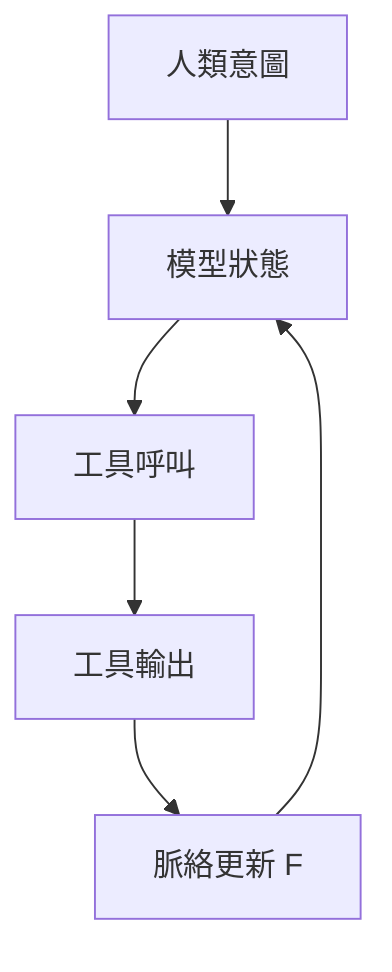

# ContextEngineering上下文工程

> **TL;DR**：LLM 是接龍機；Agent 用函數 F 在「夠用脈絡」與「長度／成本上限」間做取捨，就是上下文工程。

| 欄位 | 內容 |
|---|---|
| 類別 | LLM 系統工程／Agent 基礎設施 |
| 提出年 | — |
| 主要應用 | 工具迴圈、長對話、多代理協作 |
| 父頁 | [[大語言模型]] |
| 子頁 | [[檢索增強生成]]、[[李宏毅2025上下文工程導論要旨]] |
| 難度 | ★★★★☆ |
| 別名 | Context Engineering、CE |

## 重點

- **【核心發現】**上下文工程是 AI 從「接龍機」進化為「實作代理人」的核心控制術；透過函數 $F$ 在長度成本與脈絡資訊量之間進行動態平衡，能確保 Agent 在長對話與多工具迴圈中維持任務一致性且不迷失於雜訊。
- 無 CE 時脈絡近似無限拼接 \(C_{t+1}=C_t\oplus I_t\oplus O_t\)，很快撞上下文長度上限。
- 有 CE 時以函數 \(F\) 更新脈絡：在「不能太長（成本／注意力）」與「不能太短（失憶）」間取捨。
- Agent 可視為守門人：決定模型最終看到什麼、以何種粒度保留歷史。
- **觀測優先**：為每次工具呼叫保留「人類意圖一句話＋工具 schema 片段＋輸出摘要」三件套，便於事後除錯與回放。
- **壓縮策略分級**：先丟棄高冗餘日誌，再對長文做段落級摘要，最後才動系統指令與安全規則原文。

## 細節

### 架構地圖

### 來源摘記

footer 所列 `raw/web/AI Agent (13)：核心技術 Context Engineering 基本概念解說 - HackMD.md` 與 `raw/web/[生成式人工智慧與機器學習導論2025】02 Context Engineering - HackMD.md` 共構「無 CE 拼接 vs 有 CE 更新」與 Agent 守門人角色—對應本頁三條重點與架構地圖迴圈。與 [[李宏毅2025上下文工程導論要旨]]、[[AI協作三階段Prompt知識庫Agent]] 併讀可接到課程化定義與產品化 Lv3。

- 與 [[AI協作三階段Prompt知識庫Agent]] 的 Lv3 對齊：從產品敘事落到「可實作的上下文狀態機」。

## 相關概念

- [[李宏毅2025上下文工程導論要旨]] — 導論2025 第2講脈絡（CE 組成、Agent、選擇／壓縮／多代理）
- [[大語言模型]]
- [[檢索增強生成]]
- [[AI協作三階段Prompt知識庫Agent]]

## 名詞對照表

| 中文 | 英文 | 縮寫 |
|---|---|---|
| 上下文工程 | context engineering | CE |

## 延伸閱讀

- [[李宏毅2025上下文工程導論要旨]]｜導論整理
- [[檢索增強生成]]｜外掛知識接地

## 修訂歷史

- 2026-06-10：補充【核心發現】並校準 v3 規範。
- 2026-04-25：升級 v3（補 TL;DR／Infobox／`## 細節` 前置架構地圖與來源摘記；`## 重點` 增觀測優先與壓縮分級；保留原 lead、三條重點與細節末句）
- 2026-04-19：初稿

---
來源：`raw/web/AI Agent (13)：核心技術 Context Engineering 基本概念解說 - HackMD.md`；`raw/web/[生成式人工智慧與機器學習導論2025】02 Context Engineering - HackMD.md`
最後更新：2026-06-10
