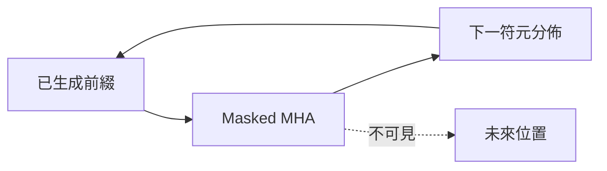

# Decoder遮罩自注意力

> **TL;DR**：自回歸解碼僅能依已產生前綴對齊鍵值；Masked MHA 遮住未來位置，使訓練與推論因果一致；與 [[非自回歸NAT解碼]] 對讀速度與品質權衡。

| 欄位 | 內容 |
|---|---|
| 類別 | 神經網路機制／序列解碼 |
| 提出年 | 2017（Transformer 族） |
| 主要應用 | GPT 類生成、語音辨識解碼端 |
| 父頁 | [[Transformer架構]] |
| 子頁 | [[非自回歸NAT解碼]]、[[CrossAttention編解碼橋接]] |
| 難度 | ★★★★☆ |
| 別名 | Masked Multi-Head Self-Attention（解碼端） |

## 重點

- **【核心發現】：Masked 自注意力機制透過強制「因果遮罩」，解決了生成任務中「未來不可見」的約束問題，使模型能以自回歸 (AR) 方式逐一產出符元，維持訓練與推論的一致性。**
- 一般 self-attention 中每個輸出可看完整輸入序列；Decoder 中改為 masked：例如產生 \(b_2\) 時只允許對 \(a_1,a_2\) 的鍵做對齊，\(k_3,k_4\) 等未來位置不參與 softmax。
- 理由：生成順序由左而右，推論時尚未存在未來符元，訓練時必須與推論因果一致。
- 自回歸解碼常搭配 BOS／EOS；若前步預測錯誤可能 error propagation，實務上另有排程採樣、Beam Search 等緩解。

## 細節

### 架構地圖

### 李宏毅 2021 講義與技術增補

- **Auto-Regressive (AR) 運作模式**：
  - **流程**：給予 BOS (Start Token) 作為起始輸入，輸出向量長度等同於字典大小（Vocab Size），經 Softmax 得到機率分佈後，選取機率最高（或經採樣）的 Token 作為下一個時間點的輸入。
  - **Error Propagation**：一步錯步步錯的風險。
  - **停止條件**：當模型輸出 EOS (End of Sentence) 符號時，代表生成結束。
- **訓練與測試的 Mismatch (Exposure Bias)**：
  - **Teacher Forcing**：訓練時給予正確答案作為輸入，但測試時模型只能依賴自己的輸出。這導致模型在測試時面對錯誤時缺乏修復能力。
  - **Scheduled Sampling**：訓練時偶爾故意餵入模型自己的錯誤輸出，以提升其穩健性。

### 進階解碼技術與優化目標
- **Guided Attention**：在語音辨識或合成中，預期注意力應是「由左至右」的單調對齊。透過強加限制（如 Monotonic Attention），可避免模型漏掉輸入訊息。
- **Beam Search**：Greedy Decoding 每步只選最優，不一定是全域最優。Beam Search 同時保留數個候選路徑，以尋找整體機率最高的句子。
  - **適用場景**：答案明確的任務（如翻譯、語音辨識）。在需要創造力的任務（如故事生成）中，過度追求高機率可能導致「鬼打牆」或內容平庸。
- **BLEU Score vs. Cross Entropy**：
  - 訓練時通常優化 Cross Entropy（逐詞機率），但評估時看 BLEU Score（整句相似度）。兩者不完全正相關。
  - **RL 介入**：由於 BLEU Score 不可微分，難以直接用梯度下降優化。此時可將 BLEU 視為 Reward，利用強化學習（Reinforcement Learning）技術來直接訓練模型。
- **Copy Mechanism (Pointer Network)**：允許模型直接從輸入序列中「複製」詞彙（如專有名詞、罕見詞）到輸出端，提升處理 OOV (Out-of-vocabulary) 的能力。

### Encoder 對照與 NAT

- 與 Encoder 差異：Decoder 在中間子層使用 Masked Self-Attention，其餘結構與 Encoder 類似處可對照圖示比較。
- 與 [[非自回歸NAT解碼]] 對讀：NAT 一次平行產出整句，以速度換取品質權衡。

## 相關概念

- [[Transformer架構]]
- [[非自回歸NAT解碼]]
- [[CrossAttention編解碼橋接]]

## 名詞對照表

| 中文 | 英文 | 縮寫 |
|---|---|---|
| 自回歸 | autoregressive | AR |
| 暴露偏差 | exposure bias | — |

## 延伸閱讀

- [[Transformer架構]]｜三大形態
- [[非自回歸NAT解碼]]｜平行解碼

## 修訂歷史

- 2026-05-22：增補 Guided Attention、BLEU vs. Cross Entropy 辯證、Pointer Network 與【核心發現】。
- 2026-05-10：將李宏毅 2021 講義增補細節（AR 流程、Error Propagation、Teacher Forcing/Mismatch 討論、解碼策略）移至細節欄位。
- 2026-04-26：升級 v3（補 TL;DR／Infobox／`## 細節` 內架構地圖與來源摘記；保留原細節條列與 `## 重點`／`## 相關概念`）
- 2026-04-17：初稿

---
來源：`raw/web/【機器學習2021】12~13 Transformer - HackMD.md`、`raw/web/【深度學習與神經網路】5.3 Transformer 機制解說 (下).md`
最後更新：2026-05-22

