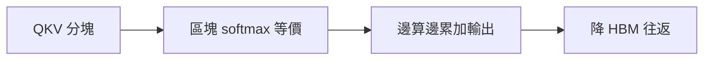

# FlashAttention記憶體感知注意力

> **TL;DR**：用分塊與數學等價重排，讓 softmax 注意力在 GPU 上少物化完整矩陣、少往返 HBM，長上下文常明顯加速且不改數值精度。

> 針對 GPU 上 HBM 與片上 SRAM 的頻寬瓶頸，以等價數學重排 softmax 與加權累加，在**不犧牲數值精度**下減少對完整注意力矩陣的物化與多趟讀寫，長序列時可顯著加速。

| 欄位 | 內容 |
|---|---|
| 類別 | 注意力效率／推理優化 |
| 提出年 | Dao et al. FlashAttention 系列 |
| 主要應用 | 長上下文 LLM、訓練與推理吞吐 |
| 父頁 | [[Transformer架構]] |
| 子頁 | [[KVCache自回歸推論快取]]、[[注意力機制]] |
| 難度 | ★★★★★ |
| 別名 | FlashAttention |

## 重點

- **瓶頸**：算力強但 SRAM 小；Q/K/V 存 HBM，傳統實作為數值穩定需多趟掃描（找 max、算分母、乘 V），I/O 成為主成本。
- **技巧**：分塊載入後以「暫假區域最大、再動態修正」維持與全域 softmax 等價；可跳過完整 \(\hat{A}\) 寫回，邊算邊累加輸出 \(O\)。
- **效果與限制**：長上下文（如 4k）加速明顯；極短序列時其他開銷主導，收益小；超長仍可能受 HBM 容量限制。
- **與架構主線**：實作層優化，不改 [[Transformer架構]] 數學定義，但改變可部署的序列長度與成本曲線。
- **組合技**：常與 [[KVCache自回歸推論快取]] 並用，分別優化「單步 attention 內部」與「跨 decode 步」重複計算。

## 細節

### 架構地圖

### 與 KV 分工（保留）

- 與 [[KVCache自回歸推論快取]] 分工：Flash 優化**單次 attention 內部**；KV Cache 解決**跨 decode 步**的重複 K/V 計算。

### 來源摘記

`raw/web/加快語言模型生成速度 Flash Attention x KV Cache - HackMD.md` 將 FlashAttention 與 KV Cache 並列為生成加速兩軸：前者壓低 attention 內部記憶體流量，後者避免自回歸每步重算歷史 K/V—對應本頁重點與「與 KV 分工」段。與 [[Transformer架構]]、[[注意力機制]] 併讀可回到數學定義與部署脈絡。

## 相關概念

- [[KVCache自回歸推論快取]]
- [[Transformer架構]]
- [[LLM多GPU訓練記憶體優化]]

## Muse 種子：與 [[KVCache自回歸推論快取]] 成對（原題：加快語言模型生成速度：Flash Attention 和 KV Cache）

## 名詞對照表

| 中文 | 英文 | 縮寫 |
|---|---|---|
| 高頻寬記憶體 | High Bandwidth Memory | HBM |

## 延伸閱讀

- [[Transformer架構]]｜形態與瓶頸總覽
- [[注意力機制]]｜數學與變體

## 修訂歷史

- 2026-04-26：升級 v3（補 TL;DR／Infobox／`## 細節` 內架構地圖與來源摘記；`## 重點` 增與架構主線及組合技；保留原 lead、三條重點、KV 分工、`## 相關概念`、Muse）
- 2026-04-17：初稿

---
來源：`raw/web/加快語言模型生成速度 Flash Attention x KV Cache - HackMD.md`
最後更新：2026-04-26
