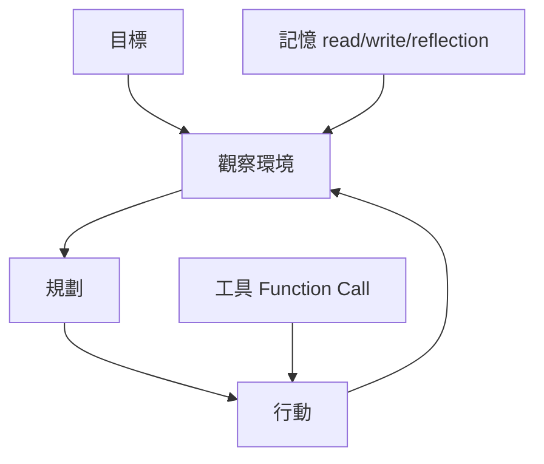

# LLM型AI Agent機制

> **TL;DR**：Agent 在目標下循環「觀察—行動」；記憶、工具與規劃可模組化；現常以 LLM 文字 化介面，多演示未重訓新模型。

> **[[AI Agent]]**：人類給**目標**，系統依**觀察**選**行動**以逐步達成。傳統強化學習需人設 reward、跨任務不易泛化；現常以 **[[大語言模型]]** 把目標／環境／行動都**文字化**，本質上 仍是語言接龍的應用（筆記強調：許多演示**未再訓練新模型**，仰賴既有 LM 能力）。

| 欄位 | 內容 |
|---|---|
| 類別 | LLM 應用／Agent 架構 |
| 提出年 | 2025（李宏毅筆記整理） |
| 主要應用 | 工具呼叫、RAG、規劃型助理 |
| 父頁 | [[大語言模型]] |
| 子頁 | [[企業AI Agent應用]]、[[檢索增強生成]] |
| 難度 | ★★★★☆ |
| 別名 | AI Agent、LLM Agent |

## 重點

- **【核心發現】**Agent 的威力不僅來自模型，更來自調度層（Orchestration Layer）對工具、記憶與情境評估的精確掌握。
- **經驗與記憶**：長期記憶過長會「超憶」般拖累推理；實務拆成 **read**（檢索／[[檢索增強生成|RAG]]）、**write**（篩選寫入）、**reflection**（重組記憶），亦可建 **Knowledge Graph**（如 GraphRAG）。
- **工具使用（Function Call）**：在 **System Prompt** 定義工具規格，模型輸出再觸發外部程式；工具多時可加「工具選擇模組」。
- **對工具的信任**：模型會權衡內部先驗與外部檢索；與內部知識差距過大或日期過新的資訊，說服力不同。研究顯示模型傾向相信**較新發布**或由 **AI 同類**（同族模型）生成的資訊，即使該資訊是錯誤的（呈現出一種「群體偏見」）。
- **計畫（Planning）**：可先列 plan 再執行，但若觀察與預期不符需**重規畫**；不可逆動作可先ใน**腦內／世界模型**模擬（與推理講次之「小劇場」呼應）。早期趨勢由 **AutoGPT** 開啟，展現了 LLM 自我迭代計畫的可能性。
- **互動型態**：真實對話非純回合制，需考慮打斷與並行回饋。
- **運作迴圈**：Agent 遵循「目標 $\to$ 觀察 (Observation) $\to$ 行動 (Action) $\to$ 影響環境 $\to$ 新觀察」的持續循環。
- **記憶效能**：研究發現對現階段 LLM 而言，提供**正面範例**（成功的經驗）比負面回饋（不要做什麼）更有效。
- **規劃能力評估**：在「神秘方塊世界 (Mystery Block World)」或「旅遊規劃」等複雜限制任務中，LLM 原生正確率常極低。經典案例包含 **Voyager** 透過在 **Minecraft** 世界中不斷寫入新經驗，最終學會打造鑽石鎬等複雜技能。
- **逃脫用哥列姆 (Golem) 寓言**：Agent 如同《葬送的芙莉蓮》中的緊急安全裝置，能根據環境變化（如敵人突襲）即時**反思 (Reflection)** 並動態修正計畫（從評估傷勢轉為防禦保護）。
- **系統架構分層**：
    - **Slow Agent**：高層次系統，負責規劃與產生人類可理解的指令。
    - **Fast Agent**：低層次系統，將指令轉化為實際行動（如操作機械手、產生控制代碼）。

## 細節

### 架構地圖

### 調度層 (Orchestration Layer)
負責管理代理內部的推理與行動流程。它協調「觀察、思考、決定、行動」的循環，確保代理能根據預定邏輯與歷史記憶進行決策，而非單純依賴模型生成文字。

### 代理評估：情境測試 (Scenario Testing)
傳統「金標準測試資料集」容易因模型更新或提示詞微調而失效。**情境測試**著重於特定任務的完成度與結果（Outcome），而非僅僅流程細節。這為自主或半自主代理提供了更具彈性且貼近真實應用（如旅遊規劃、訂單系統）的評估框架。

### Grounded Search 與函式呼叫的協同
透過函式呼叫（Function Calling）使代理人能利用外部工具，減少僅靠模型內部知識產生幻覺（Hallucination）的風險。結合 **Grounded Search**（如 Google 搜尋資料引入）可確保代理人在執行多步驟任務時，能獲得準確、安全且可靠的即時資訊。

### 元件與取捨

| 元件 | 角色 |
|---|---|
| 記憶 | 過長易噪；read／write／reflection 分流 |
| 工具 | 規格在 System Prompt；多工具時加選擇器 |
| 規劃 | 觀察偏離則重規畫；高風險前先模擬 |

### 來源摘記

李宏毅 2025 筆記定義 Agent：人給目標、系統觀察後採行動；並對照以 RL 下棋為例時 reward 由人訂、跨任務不易通用之限。後段銜接以 LM 文字化目標／觀察／行動、常沿用既有模型能力之實務演示—與本頁 lead 及重點各條對齊。
Day 3 直播精華（Google 官方直播）補充了調度層、情境測試與 Grounded Search 的協同運作邏輯。

## 相關概念

- [[企業AI Agent應用]] — 產業場景對照
- [[AI虛擬村莊]] — 生成式代理人社會模擬案例
- [[提示工程]] — System／User prompt 設計
- [[檢索增強生成]] — read 模組常見實作
- [[推理模型訓練與DeepSeek R1]] — 推理與規劃的進階形式
- [[李宏毅2025生成式ML筆記索引]]
- [[一人公司AI實踐]] — AI Agent **機制-實踐對偶**：本頁是機制端（目標→觀察→行動／記憶／工具／規劃），對頁是實踐端（領域知識×AI 執行 + ROI 量化）；機制懂卻不會疊組件落地、ROI 好卻不能擴展（batch-09 #B，#M3 對偶第 10 對 → 達雙保險門檻）
- [[二端對偶骨架]] — meta-Insight #M3 主鍵（成熟範式 0.85）；本頁為 #M3 第 10 對證據（機制端）

## 名詞對照表

| 中文 | 英文 | 縮寫 |
|---|---|---|
| 函數呼叫 | function calling | FC |
| 檢索增強生成 | retrieval-augmented generation | RAG |
| 調度層 | Orchestration layer | — |

## 延伸閱讀

- [[企業AI Agent應用]]｜落地場景
- [[檢索增強生成]]｜read 路線

## 修訂歷史

- 2026-05-27：增補 Day 3 內容（調度層、情境測試、Grounded Search）與核心發現標籤
- 2026-06-06：採納 batch-09 #B（LLM型AI Agent機制 × 一人公司AI實踐）— `## 相關概念` 補連 [[一人公司AI實踐]]＋[[二端對偶骨架]]，標記機制-實踐對偶；#M3 第 10 對達雙保險門檻
- 2026-05-09：補強「哥列姆」寓言、Slow/Fast Agent 分層與實體應用（2024 導論講義彙整）
- 2026-05-09：整合 2025 講義細節（運作迴圈、工具信任、規劃評估與腦內模擬）
- 2026-04-26：升級 v3（補 TL;DR／Infobox／`## 細節` 含架構地圖、元件表與來源摘記；保留原 lead 與 `## 重點`／`## 相關概念`）
- 2026-04-17：初稿

---
來源：`raw/web/[2025李宏毅ML] 第2講：一堂課搞懂 AI Agent 的原理 (AI如何透過經驗調整行為 、使用工具和做計劃) - HackMD.md`、`raw/web/【生成式AI時代下的機器學習(2025)】02 AI Agent 的原理 - HackMD.md`、`raw/web/【生成式AI導論 2024】09~11 AI Agent、Transfoermer、可解釋性 - HackMD.md`、`raw/web/【大語言模型應用與實戰】[Day 3] 生成式 AI 代理人.md`
最後更新：2026-05-27
