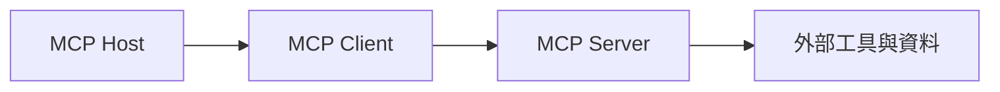

# MCP協議

> **TL;DR**：MCP 是 AI 主機與外部工具間的開放「USB-C」層；Host／Client／Server 三分工，換來跨工具可移植的工具包。

> Model Context Protocol（模型上下文協議）是 Anthropic 於 2024 年 11 月推出的開放標準，讓 AI 模型透過統一介面連接外部工具、資料庫與服務——AI 世界的「USB-C 接口」。

| 欄位 | 內容 |
|---|---|
| 類別 | Agent 基礎設施／工具協定 |
| 提出年 | 2024-11（Anthropic 公開） |
| 主要應用 | IDE 外掛、桌面助理、資料／日曆／Repo 串接 |
| 父頁 | [[大語言模型]] |
| 子頁 | [[AI Agent網路瀏覽與感知]]、[[Agentic Engineering四層架構]] |
| 難度 | ★★★★☆ |
| 別名 | Model Context Protocol、MCP |

## 重點

- **【核心發現】**MCP 是 AI 工具化的標準化解藥，將複雜的 API 整合轉化為可插拔的「USB-C」式服務。
- **定位**：連接 LLM 與外部資源的標準化橋樑，不是 LLM、不是應用程式、不是程式語言
- **類比**：如同 USB-C 標準化了硬體接口，MCP 標準化了「AI 主機 ↔ 工具」的通訊格式
- **架構三元件**：Host（AI 應用如 Claude Desktop）/ Client（嵌入主機的連接器）/ Server（工具提供者）
- **解決的痛點**：過去每個 AI 框架各自定義工具調用格式，MCP 讓一個 Server 可服務所有兼容的 AI 主機
- 支援平台：Cursor、Windsurf、Claude Desktop、GitHub Copilot 等主流 AI 工具已採用
- **治理視角**：同一 Server 多主機共用時，權限與稽核應跟著「人類批准點」設計，而非只信模型自律。
- **版本與相容**：主機升級與 Server schema 變更可能不同步，上線清單應含 smoke test 與回滾策略。

## 細節

### 架構地圖

### Gemini 對 MCP 的支持
Gemini 官方已在公開範例中展示對 MCP 的支持。MCP 作為輕量化的 API 封裝，有助於簡化 Gemini 在代理人流程中的跨系統整合。優點在於顯著降低整合成本與開發門檻，但在處理高度敏感資料的生產環境中，仍需配合嚴格的安全措施與版本控制。

### 來源摘記

footer 所列 `raw/web/深入理解 MCP（Model Context Protocol）搭配簡易實作.md`、`白話文教學：AI 怎麼幫你動手做事？…`、`Cursor vs Claude Code比較.md` 共構「USB-C 類比／五種操控方式對照／Host-Client-Server」敘事—對應本頁五條重點與架構地圖。與 [[Claude Code架構]]、[[AI Agent網路瀏覽與感知]] 併讀可接到實作堆疊與安全邊界。
Day 3 直播精華（Google 官方直播）確認了 Gemini 對 MCP 的整合能力與生產環境建議。

### 五種 AI 操控軟體方式的定位

| 方式 | 白話說明 | 速度 | 穩定度 |
|------|---------|------|------|
| API | 程式直接呼叫程式 | 極快 | 極高 |
| CLI | 在終端機打指令 | 快 | 高 |
| **MCP** | **幫 AI 包好的工具包** | **快** | **高** |
| GUI | 你平常用的 App 畫面 | 慢 | 高 |
| Browser Use | AI 模擬人類點按鈕 | 最慢 | 最低 |

MCP 本質是把 API/CLI 封裝成 AI 可直接調用的工具包，兼顧速度與穩定性。

### 架構細節

**MCP Host**（主機）
- 使用 LLM 的應用程式：Claude Desktop、Cursor、聊天機器人
- 負責調度 LLM 操作、管理多重連線、整合外部資訊

**MCP Client**（客戶端）
- 嵌入主機的元件，負責與 Server 建立一對一連線
- 處理訊息往來、記錄 Server 提供的功能、管理連線初始化

**MCP Server**（伺服器）
- 工具提供者，暴露外部服務給 AI 使用
- 可連接：Google 日曆、Gmail、Slack、GitHub、本地資料庫等

### 為什麼不只用 Function Calling？

Function Calling（OpenAI）和 bind_tools（LangChain）概念類似，但受限於框架綁定，難以移植。MCP 將工具串接擴展成**跨平台開放標準**：只需建一個 MCP Server，所有兼容的 AI 主機皆可使用。

### 實際使用場景

- Claude Code + Notion MCP → AI 直接讀寫 Notion 資料庫
- Claude Code + GitHub MCP → AI 讀取 PR、commit、issue
- Claude Code + Google Calendar MCP → AI 讀寫行事曆
- Cursor + Supabase MCP → 一鍵串接資料庫，免手動 API 設定

### 安全注意事項

安裝第三方 MCP Server 前需審查源碼，確認無惡意連線。啟用「需要人類批准」模式，避免 AI 在未授權情況下執行高風險操作（見 [[AI Agent網路瀏覽與感知]] §提示詞注入攻擊風險）。

## 相關概念

- [[AI Agent網路瀏覽與感知]]
- [[Claude Code架構]]
- [[Agentic Engineering四層架構]]
- [[Agent Skills設計模式]]
- [[n8n工作流程]]

## 名詞對照表

| 中文 | 英文 | 縮寫 |
|---|---|---|
| 模型上下文協定 | Model Context Protocol | MCP |

## 延伸閱讀

- [[Claude Code架構]]｜主機側實作
- [[AI Agent網路瀏覽與感知]]｜風險與邊界

## 修訂歷史

- 2026-05-27：增補 Gemini 對 MCP 的支持細節與核心發現標籤
- 2026-04-25：升級 v3（補 TL;DR／Infobox／`## 細節` 前置架構地圖與來源摘記；`## 重點` 增治理與相容；保留原 lead、五條重點與細節全文）
- 2026-04-19：初稿

---
來源：`raw/web/深入理解 MCP（Model Context Protocol）搭配簡易實作.md`、`raw/web/白話文教學：AI 怎麼幫你動手做事？API、CLI、MCP、瀏覽器控制的選擇邏輯.md`、`raw/web/Cursor vs Claude Code比較.md`、`raw/web/【大語言模型應用與實戰】[Day 3] 生成式 AI 代理人.md`
最後更新：2026-05-27
