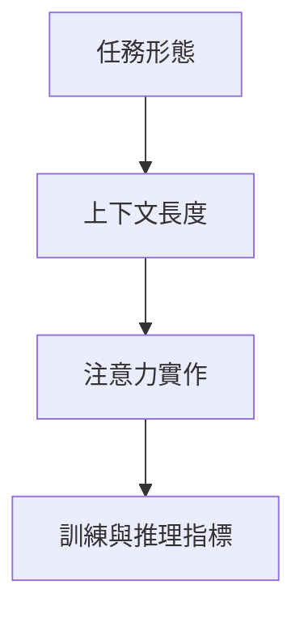

# Transformer架構核心機制

> **TL;DR**：從注意力權重、多頭分工、二次複雜度到訓練／推理檢核，收斂 Transformer 落地時「先決三事」與常見工程誤區。

> 聚焦 Transformer 的可操作核心：注意力計算、結構配比、長序列效率與落地取捨。

| 欄位 | 內容 |
|---|---|
| 類別 | 神經網路架構／注意力機制 |
| 提出年 | 2017（Vaswani et al.） |
| 主要應用 | NLP、多模態、長上下文部署 |
| 父頁 | [[Transformer架構]] |
| 子頁 | [[FlashAttention記憶體感知注意力]]、[[注意力機制]] |
| 難度 | ★★★★★ |
| 別名 | Transformer core、QKV 機制 |

## 重點

- 注意力不是「看全部」而已，重點是如何分配權重與保留梯度。
- 多頭機制的價值在於分工建模，不是單純增加參數。
- 長序列成本來自 `QK^T` 的二次複雜度，工程優化是部署關鍵。
- **解耦三軸**：算子實作（Flash／window）、權重配比（層數／頭數／維度）、任務形態（Encoder／Decoder）應分開調，不要混成一個旋鈕。
- **指標對齊**：線上除 perplexity 外，應固定追蹤延遲、峰值記憶體與任務正確率，避免「曲線好看、產品不好用」。

## 細節

### 架構地圖

### 設計時要先決定的三件事

1. **任務類型**：理解任務優先 Encoder，生成任務優先 Decoder。
2. **上下文長度**：超長文本要先規劃記憶體策略（Flash/Window/KV cache）。
3. **延遲與成本**：訓練可重，推理要穩，兩者優化手段不同。

### 常見錯誤

- 只拉大 context，卻未同步優化注意力實作，導致吞吐下降。
- 只看 perplexity，不看任務指標，造成模型「好看不好用」。
- 多頭數量增加但 head dim 太小，出現資訊瓶頸。

### 工程檢核清單

- 訓練：loss 曲線、梯度穩定、有效 batch。
- 推理：token/s、首 token 延遲、GPU 記憶體峰值。
- 品質：長文本問答一致性、跨段引用正確率。

### 來源摘記

`raw/notebooklm/全民瘋AI-Python-機器學習-深度學習.md` 列 Transformer、自注意力、多頭與位置編碼等筆記動線，支撐本頁「任務—長度—實作」三決策與常見錯誤中對位置與效率的提醒。`raw/notebooklm/IPAS-AI應用規劃師-中級初級通過筆記.md` 將 LLM 置於應用規劃末端，呼應父頁 [[Transformer架構]] 與 [[大語言模型]] 的產品脈絡。

## 相關概念

- [[Transformer架構]]
- [[大語言模型]]
- [[FlashAttention記憶體感知注意力]]
- [[KVCache自回歸推論快取]]
- [[線性注意力與Mamba架構]]
- [[李宏毅2025生成式ML筆記索引]] — 工程紀律的「解耦三軸」（算子／配比／任務形態）與筆記索引的「五講群獨立索引」是「**軸解耦**」原則的工程-學習鏡像（batch-05 #D，與 batch-04 #C 訓練-推論軸解耦並列為寬解候選）

## 名詞對照表

| 中文 | 英文 | 縮寫 |
|---|---|---|
| 多頭注意力 | Multi-Head Attention | MHA |

## 延伸閱讀

- [[Transformer架構]]｜三形態地圖
- [[注意力機制]]｜數學與變體

## 修訂歷史

- 2026-05-05：採納 batch-05 #D（Transformer 架構核心機制 × 李宏毅 2025 索引）— `## 相關概念` 補連 [[李宏毅2025生成式ML筆記索引]] 雙向，標記工程-學習軸解耦鏡像；與 batch-04 #C 累積 2 對軸解耦，作 #M1 寬解涵蓋的證據
- 2026-04-26：升級 v3（補 TL;DR／Infobox／`## 細節` 內架構地圖與來源摘記；`## 重點` 增解耦三軸與指標對齊；保留原 lead、三條重點、既有 `###` 小節全文、`## 相關概念`）
- 2026-04-22：初稿整理

---
來源：`raw/notebooklm/全民瘋AI-Python-機器學習-深度學習.md`、`raw/notebooklm/IPAS-AI應用規劃師-中級初級通過筆記.md`
最後更新：2026-05-05
