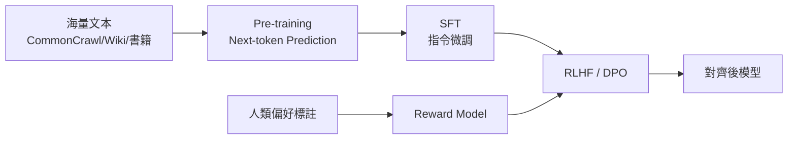

# 大型語言模型

> **TL;DR**：大型語言模型 (Large Language Model, LLM) 指參數量達數十億至數兆、以 Transformer 為核心架構、在網路級語料上進行自監督預訓練的語言模型；代表 GPT-4、Claude、Gemini、Llama 系列，是當代生成式 AI 的核心引擎。

| 欄位 | 內容 |
|---|---|
| 類別 | 生成式 AI / 基礎模型 |
| 提出年 | 2018（GPT-1）／ 2020（GPT-3 引爆規模化） |
| 主要應用 | 對話、寫作、程式生成、翻譯、摘要、Agent、RAG |
| 父頁 | [[深度學習]] |
| 難度 | ★★★★☆ |
| 別名 | LLM、大語言模型、Foundation Language Model |

## 重點

- **【核心發現】**LLM 真正改變產業的不是「會講人話」，而是「**規模化後的湧現能力**」——當模型大到一定門檻（百億參數級），會出現訓練目標未曾明示的能力（in-context learning、推理、跨任務泛化）；這個從「量變」到「質變」的轉折點是 GPT-3（175B）所揭示的根本現象。
- **核心架構**：[[Transformer架構]] Decoder-only（GPT 系列）或 Encoder-Decoder（T5 系列）。
- **訓練範式**：[[自監督學習]] next-token prediction + RLHF / DPO 對齊。
- **三階段**：Pre-training（海量自監督）→ SFT（指令微調）→ RLHF（偏好對齊）。
- **核心觀察**：
  - [[規模定律]] (Scaling Laws)：性能與參數、資料、算力呈冪律。
  - [[湧現能力]] (Emergent Abilities)：規模門檻後突現的能力。
  - In-context Learning：不更新權重，僅靠 prompt 範例學習。

## 細節

### 代表模型時間軸

| 年 | 模型 | 參數量 | 里程碑 |
|---|---|---|---|
| 2018 | GPT-1 / BERT | 110M / 340M | Transformer 預訓練範式確立 |
| 2019 | GPT-2 | 1.5B | 拒絕公開引發討論 |
| 2020 | GPT-3 | 175B | In-context learning 揭示 |
| 2022 | ChatGPT / InstructGPT | — | RLHF + 對話介面普及 |
| 2023 | GPT-4 / Claude / Llama 2 | — | 多模態、開源生態 |
| 2024+ | Claude 3.5、GPT-4o、Gemini 1.5 | — | 長 context、推理、Agent |

### 三階段訓練

### 推論時的關鍵參數

| 參數 | 作用 |
|---|---|
| Temperature | 採樣機率分佈的平滑度（見 [[Softmax迴歸]]） |
| Top-p / Top-k | 限制採樣候選空間 |
| Max tokens | 輸出長度上限 |
| System prompt | 角色設定與行為約束 |

### LLM 主要應用範式

1. **Chat**：對話互動（ChatGPT、Claude）。
2. **RAG**：檢索增強生成，外接知識庫。
3. **Tool Use / Agent**：呼叫工具、執行多步任務。
4. **Code**：程式生成與重構（Copilot、Claude Code）。
5. **多模態**：圖像、語音、影片整合（GPT-4o、Gemini）。

### 限制與爭議

- **幻覺 (Hallucination)**：生成事實錯誤但語感正確的內容。
- **算力與能源**：訓練成本動輒千萬美元。
- **資料偏見**：訓練語料偏差被放大。
- **對齊難題**：人類偏好難以完整編碼為 Reward。
- **評估困難**：開放式輸出難用單一指標衡量。

## 相關概念

- [[Transformer架構]] — LLM 的核心架構
- [[自監督學習]] — LLM 的主要訓練範式
- [[規模定律]] — LLM 規模化的理論基礎
- [[湧現能力]] — LLM 的關鍵現象
- [[RLHF]] — 對齊階段核心方法
- [[PyTorch]] — LLM 訓練主流框架

---
來源：站內 wikilink 錨點補齊、`wiki/自然語言處理概論.md` 上下文
最後更新：2026-06-05
