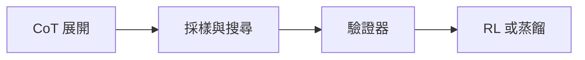

# 推理模型訓練與DeepSeek R1

> **TL;DR**：推理模型靠 test-time compute 拉長思考鏈；用搜尋／驗證／模仿與 RL 放大既有 foundation，弱底模換蒸餾常更划算。

> **深度思考／推理模型**在輸出答案前產生長鏈 **reasoning**，屬 **test-time compute**（與 AlphaGo 類比）。打造方式含：**強 CoT**、**多樣本搜尋與驗證**、**模仿教師推理過程**、以及 **RL 只獎勵結果正確**（[[大語言模型]] 能力的放大器而非無中生有）。

| 欄位 | 內容 |
|---|---|
| 類別 | 大語言模型／推理與對齊 |
| 提出年 | — |
| 主要應用 | 數學／程式、長鏈 CoT、蒸餾小模型 |
| 父頁 | [[大語言模型]] |
| 子頁 | [[推理過程長度控制]]、[[LLM評估指標]]、[[LLM評測陷阱]] |
| 難度 | ★★★★★ |
| 別名 | reasoning model、DeepSeek-R1 |

## 重點

- **Short vs Long CoT**：從 few-shot／zero-shot CoT 到當代長鏈推理；強模型才扛得住複雜流程指令。
- **解題管線**：多次採樣 → **Majority Vote**／信心 → **Best-of-N + Verifier**；可對**中間步驟**用 process verifier 或 **Beam Search** 控制搜尋寬度。
- **模仿學習**：需合成推理資料；可只用答對樣本、或以樹搜＋逐步驗證挑過程。實務發現**不必每步都對**——模型需見過**錯誤與修正**（Stream of search、Journey Learning）才會「知錯能改」。
- **知識蒸餾**：直接讓強推理教師訓練小模型。
- **DeepSeek-R1 路線**：**R1-Zero** 以準確率為 reward，推理可冗長難讀、混雜多語；再以千級資料做可讀化與多階段 RL／模仿，並強調 **foundation 能力**決定 RL 上限——較弱 base 換 imitation 可能更有效。
- **推理成本表**：把「每題平均 reasoning token／工具呼叫次數」寫進產品 SLO，避免線上延遲與帳單失控。
- **評測防刷**：長鏈推理易與資料污染交織，線上 A/B 應含 held-out 推理集與人類 spot check（見 [[LLM評估指標]] 與 [[LLM評測陷阱]]）。

## 細節

### 架構地圖

### 來源摘記

`raw/web/[2025李宏毅ML] 第7講：DeepSeek-R1 這類大型語言模型是如何進行「深度思考」(Reasoning)的？ - HackMD.md` 以 AlphaGo 類比收斂 test-time compute，並串起 Short/Long CoT、Best-of-N、模仿與 R1-Zero／可讀化路線—對應本頁六條重點與架構地圖。與 [[推理過程長度控制]]、[[大語言模型]] 併讀可接到長度治理與能力邊界。

- **腦內小劇場**：現代推理模型（如 DeepSeek-R1、O1）表現為產生長篇內心戲，包含驗證、探索與規劃。例如姜子牙對決鄧不利多的案例中，模型會糾結於「索命咒」與「杏黃旗」的矛盾對決。
- **推理 (Reasoning) vs 推論 (Inference)**：Inference 是產生答案的行為，而 Reasoning 專指在推論階段投入巨大算力（Testing-time compute）進行長鏈思考的行為。模型推理行為不一定與人類思考過程相同。

## 打造推理模型的四種方法

打造深度思考（Reasoning）能力主要分為無需微調與需微調兩條路徑：

### A. 無需微調參數的方法 (No Fine-Tuning)
1. **優化思維鏈 (CoT Prompting)**：透過 Few-shot 或 Zero-shot Prompt 引導模型列出解題過程。
2. **推理工作流程 (Workflow)**：透過多重嘗試與驗證機制找到最佳答案，包含 **Majority Vote** (多重採樣與投票)、**Best-of-N + Verifier** (驗證器挑選最優解)、以及 **Beam Search** (控制搜尋寬度)。

### B. 需微調參數的方法 (Fine-Tuning)
3. **模仿學習與知識蒸餾 (Imitation/Distillation)**：讓模型模仿正確或可修正的推理過程（Journey Learning）。關鍵在於蒐集包含「錯誤路徑與修正」的訓練資料。
4. **結果導向的強化學習 (Outcome-Oriented RL)**：僅依據最終答案正確性給予獎勵（如 R1-Zero），而不嚴格控制中間推理過程，讓模型自主發展出驗證與規劃行為。

## 細節

### DeepSeek-R1 複雜訓練流程
1. **階段一 (Model A)**：利用 R1-Zero 產出的原始資料進行人工可讀化修正，搭配 Few-shot CoT 對基座模型進行模仿學習。
2. **階段二 (Model B)**：進行 RL 並加入「語言一致性獎勵」，確保思考過程不隨意切換語言（如中英混雜）。
3. **階段三 (Model C)**：利用 Model B 大規模自動生成 60 萬筆高品質推理資料，再次進行模仿學習以激發泛化能力。
4. **最終階段 (DeepSeek-R1)**：針對安全性 (Safety) 與幫助性 (Helpfulness) 進行最後的 RL 強化。

## 相關概念

- [[大語言模型]] — CoT 與 RLHF 脈絡
- [[推理過程長度控制]] — 下一講：別讓推理無限膨脹
- [[LLM評估指標]]、[[LLM評測陷阱]] — 數學 benchmark 是否背題
- [[李宏毅2025生成式ML課程索引]]

## 名詞對照表

| 中文 | 英文 | 縮寫 |
|---|---|---|
| 測試時計算 | test-time compute | TTC |

## 延伸閱讀

- [[推理過程長度控制]]｜長度控制
- [[大語言模型]]｜上位能力敘事

## 修訂歷史

- 2026-05-09：整合 2025 講義新增之「打造推理模型四種方法」分類與 Reasoning vs Inference 辨析。
- 2026-05-09：補強 DeepSeek-R1 多階段訓練流程與「腦內小劇場」實例（2025 講義彙整）
- 2026-04-22：升級 v3（補 TL;DR／Infobox／`## 細節` 含架構地圖與來源摘記；`## 重點` 增成本表與評測防刷；保留原 lead 與原五條重點並增兩條）
- 2026-04-17：初稿

---
來源：`raw/web/[2025李宏毅ML] 第7講：DeepSeek-R1 這類大型語言模型是如何進行「深度思考」(Reasoning)的？ - HackMD.md`、`raw/web/【生成式AI時代下的機器學習(2025) 】07 DeepSeek-R1 這類大型語言模型是如何 Reasoning 的？ - HackMD.md`
最後更新：2026-05-09
