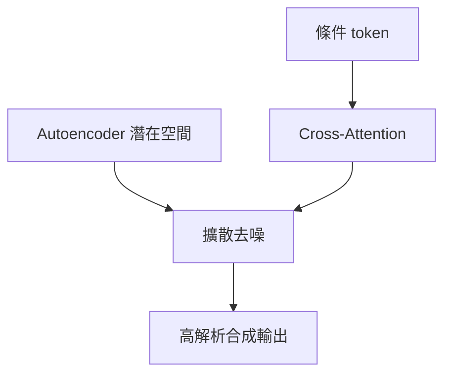

# 潛在擴散模型LDM要旨

> **TL;DR**：在強預訓練自編碼器潛在空間做擴散，壓低像素空間高維反覆去噪成本；cross-attention 支援文字／框選等條件，並以「感知 vs 語意」兩階段敘事對齊 [[擴散模型感知壓縮階段]]／[[擴散模型語意壓縮階段]]。

> 在強預訓練自編碼器的潛在空間做擴散，降低像素空間高維反覆去噪的成本；並以 cross-attention 支援文字、框選等條件，兼顧高解析合成與訓練／推理資源。

| 欄位 | 內容 |
|---|---|
| 類別 | 生成式模型／擴散模型 |
| 提出年 | 2021（LDM 論文脈絡） |
| 主要應用 | 文生圖、修補、超解析、條件合成 |
| 父頁 | [[生成式AI]] |
| 子頁 | [[擴散模型感知壓縮階段]]、[[擴散模型語意壓縮階段]] |
| 難度 | ★★★★☆ |
| 別名 | Latent Diffusion Model、LDM |

## 重點

- 像素空間 DM：訓練常耗大量 GPU-days，推理需多步序列評估；潛在空間可壓縮「難以察覺的高頻」維度。
- 以 VAE 等表示在「複雜度降低」與「細節保留」間取得較佳折衷，提升視覺逼真度。
- 條件生成：在 U-Net 式骨干加入 cross-attention，使文字／邊界框等訊號控制生成；修補、類別條件、超解析等任務皆受益。
- **兩階段壓縮敘事**：先感知壓縮去掉不易察覺高頻，再在潛在空間學語意組合；DM 不必在像素維度反覆扛全部細節梯度。
- **民主化動機**：像素 DM 訓練／採樣昂貴；LDM 降低訓練與推論成本並維持品質彈性（論文 Abstract 要旨）。

## 細節

### 架構地圖

### 與兩階段擴散敘事對讀

- 與 [[擴散模型感知壓縮階段]]、[[擴散模型語意壓縮階段]] 對讀：LDM 論文將學習拆成「感知壓縮」與「語意壓縮」兩階段敘事，解釋為何先進潛在空間再擴散。

### 來源摘記

HackMD 論文摘譯對齊 Abstract：像素空間 DM 訓練／推論昂貴；改在強預訓練自編碼器潛在空間可同時減維與保細節；引入 cross-attention 支援文字、邊界框等條件並以卷積式路線做高解析；並列修補、類條件、文生圖、無條件與超解析等任務表現—對應本頁重點與架構地圖。

## 相關概念

- [[擴散模型感知壓縮階段]]
- [[擴散模型語意壓縮階段]]
- [[生成式AI]]

## 名詞對照表

| 中文 | 英文 | 縮寫 |
|---|---|---|
| 潛在擴散模型 | Latent Diffusion Model | LDM |

## 延伸閱讀

- [[擴散模型感知壓縮階段]]｜感知階段
- [[擴散模型語意壓縮階段]]｜語意階段

## 修訂歷史

- 2026-04-25：升級 v3（補 TL;DR／Infobox／`## 細節` 內架構地圖與來源摘記；`## 重點` 增論文動機句；保留原 lead、細節對讀段、`## 相關概念`）
- 2026-04-17：初稿

---
來源：`raw/web/High-Resolution Image Synthesis with Latent Diffusion Models - HackMD.md`
最後更新：2026-04-25
