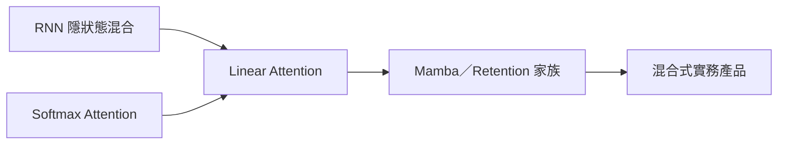

# 線性注意力與Mamba架構

> **TL;DR**：線性注意力可視為弱化「反射／遺忘」的廣義 RNN；Retention／Mamba 等調整寫入、遺忘與狀態維度，在長序列與推論吞吐上與 [[Transformer架構]] 形成取捨光譜。

> 序列建模有三條思路：**RNN 式**（隱狀態混合）、**Self-Attention 式**（全域兩兩相似度）、以及兩者的折衷與變體。[[Transformer架構]] 在**訓練**時可一次看完整序列而高度平行，利於 GPU 矩陣運算；**推論**時序列變長則 attention 成本上升。課程將 **linear attention** 解讀為「拿掉部分遺忘／反射的廣義 RNN」，並討論 **Retention／Mamba** 等如何調整記憶寫入、遺忘與狀態維度。

| 欄位 | 內容 |
|---|---|
| 類別 | 序列模型架構 |
| 提出年 | —（課程 2025 第 4 講脈絡） |
| 主要應用 | 長上下文、推論加速、混合架構 |
| 父頁 | [[Transformer架構]] |
| 子頁 | [[LLM多GPU訓練記憶體優化]]、[[語音語言模型SpeechLLM]] |
| 難度 | ★★★★☆ |
| 別名 | Linear Attention、Mamba |

## 重點

- **各架構的「理由」**：CNN 局部＋權重共享；**Residual** 緩解深網優化；**Transformer** 讓訓練平行化、GPU 友善。
- **RNN 式**：隱狀態 \(H_t\) 由過去狀態與當前輸入合成；可對應到 Agent 記憶的 read／write／reflection 類比。
- **Self-Attention**：因果遮罩下逐步生成；訓練時可平行算各位置監督訊號。
- **Linear attention**：省略 softmax 的類 attention 形式，可看成特定結構下的高效混合；**訓練**可像 attention **平行**，**推論**可像 **RNN** 逐步更新狀態。
- **記憶容量**：RNN 狀態與 Transformer 的「可區分鍵」皆有限；softmax 的競爭機制有助**動態覆寫**重要度，linear／無門控版本可能較難「改寫」舊記憶。
- **Retention／Gated Retention**：引入遺忘係數或門控，讓歷史狀態可衰減或被選擇性覆寫。
- **Mamba**：線性時間序列模型家族代表；課堂數據顯示在相同 FLOPs 下可勝過 Transformer 的 perplexity，推論吞吐亦佳。**DeltaNet** 等變形把記憶更新寫成更接近最佳化的形式。
- **實務**：Jamba、MiniMax-01 等混合線性／注意力層；視覺上亦有「未必需要 Mamba」的實證（如 MambaOut）。
- **課程動線**：長序列需求使社群「想念 RNN 的好」；linear attention 被定位為拿掉部分 fA 反射後與 attention 形式銜接的橋梁。
### 各架構計算複雜度對照 (2025 視角)

| 面向 | Transformer (SA) | RNN | Linear Attention (LA) |
|------|------------------|-----|----------------------|
| **訓練平行化** | 極佳 (全序列平行) | 差 (需逐步迭代) | 極佳 (等價 SA-Softmax) |
| **推論運算量** | 隨序列 $N$ 增長 ($O(N^2)$) | 固定 (常數運算) | 固定 (等價 RNN-Reflection) |
| **記憶遺忘** | 動態 (Softmax 競爭) | 視門控設計 | 預設永久儲存 (需外加衰減) |

- **等價關係**：Linear Attention (LA) 被證明等價於「RNN 拿掉 Reflection ($F_a$) 部分」，同時也是「Self-Attention 拿掉 Softmax」。這使其兼具訓練平行化（如 SA）與推論常數運算量（如 RNN）的優勢。
- **記憶缺陷與修復**：原生 LA 的隱狀態 $H$ 永久儲存資訊且永不遺忘；**RetNet** 引入衰減因子 $\gamma$、**Mamba 2** 則使用可學習門控來動態決定記憶更新。
- **Mamba 的崛起**：作為 Linear Attention 家族代表，Mamba 是第一個在多數規模下微幅超越強化的 Transformer (Transformer++) 且推論速度大幅領先的架構。
- **記憶更新的最佳化視角**：**DeltaNet** 將隱狀態更新解釋為一梯度下降 (GD) 步驟，讓 Memory 學習如何準確提取 Value。

## 細節

### 架構地圖

### 訓練平行 vs 推論逐步

課程強調 Transformer 主要動機是**訓練可平行**（一次餵完整序列算各位置監督），而非「RNN 記不住長程」的簡化對比；推論時 attention 需與歷史位置交互，成本隨長度上升。Linear attention 路線則試圖在「類全域混合」與「常數狀態更新」間取得工程平衡。

### 來源摘記

第 4 講稿從 CNN／Residual／Transformer 各自「存在的理由」切入，再以 RNN hidden state 與 self-attention 對照，導出拿掉 softmax 與部分時間混合後的 linear attention 圖像，並接續 Retention、Mamba 與混合架構案例—對應本頁重點各段與架構地圖。

## 相關概念

- [[Transformer架構]] — 對照基準與 softmax attention
- [[LLM多GPU訓練記憶體優化]] — 長序列下的工程壓力
- [[語音語言模型SpeechLLM]] — 超長離散 token 與效率議題
- [[李宏毅2025生成式ML課程索引]]

## 名詞對照表

| 中文 | 英文 | 縮寫 |
|---|---|---|
| 線性注意力 | linear attention | — |
| 狀態空間模型 | State Space Model | SSM |

## 延伸閱讀

- [[Transformer架構]]｜注意力主線
- [[LLM多GPU訓練記憶體優化]]｜長序列訓練成本

## 修訂歷史

- 2026-05-09：整合 2025 講義細節（LA 等價性、記憶修復機制、Mamba 與 DeltaNet）
- 2026-04-24：升級 v3（補 TL;DR／Infobox／`## 細節` 含架構地圖與來源摘記；`## 重點` 增課程動線一句；保留原長 lead 與全文要點、`## 相關概念`）
- 2026-04-17：初稿

---
來源：`raw/web/[2025李宏毅ML] 第4講：Transformer 的時代要結束了嗎？介紹 Transformer 的競爭者們 - HackMD.md`、`raw/web/【生成式AI時代下的機器學習(2025)】04 介紹 Transformer 的競爭者們 - HackMD.md`
最後更新：2026-05-09
